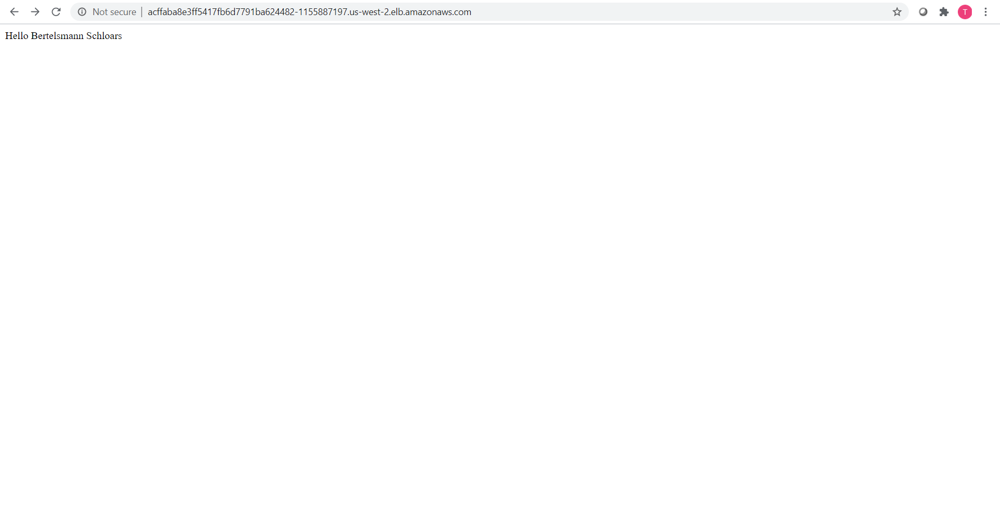
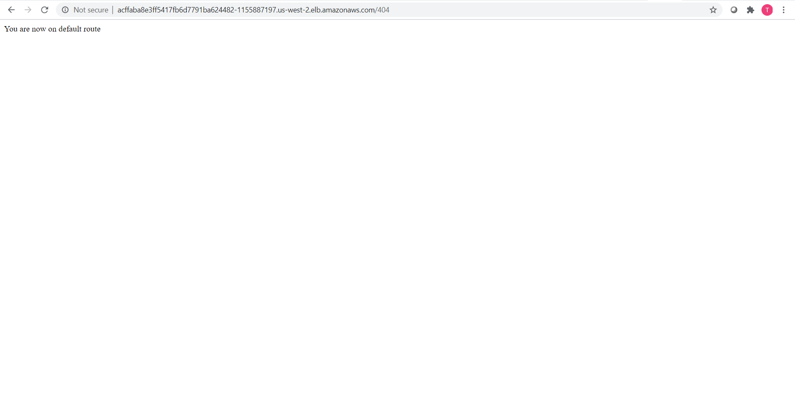
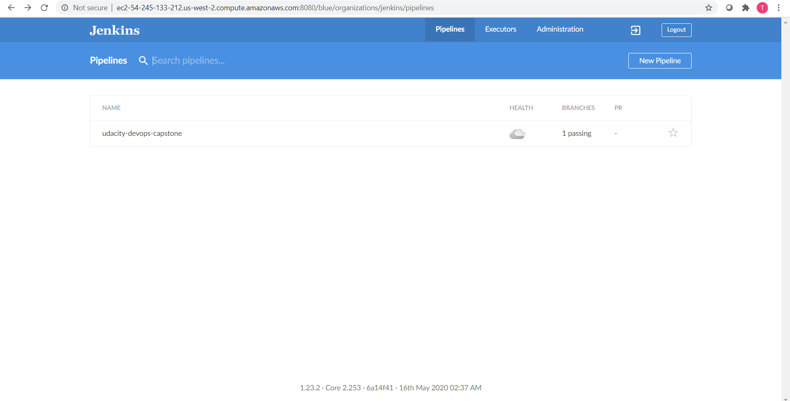
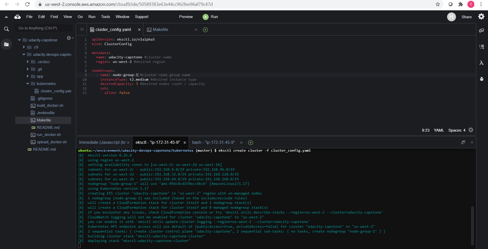
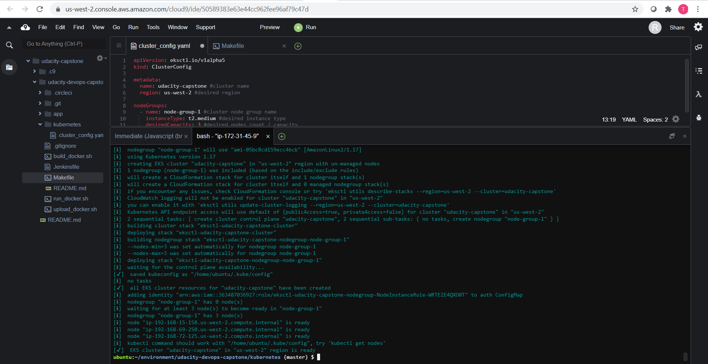
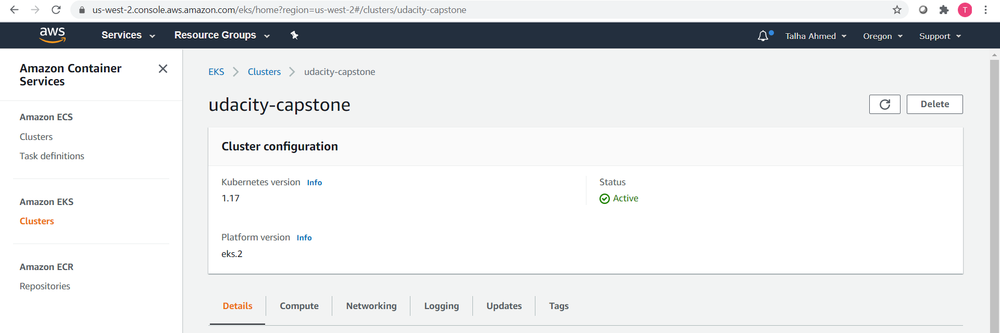
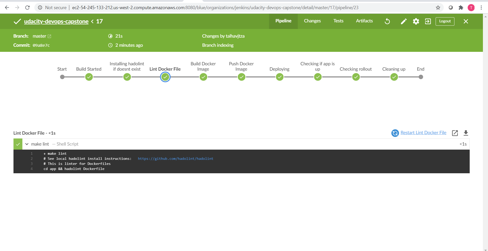
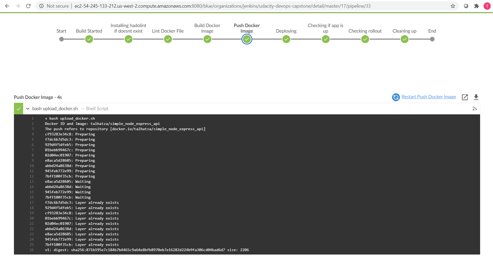
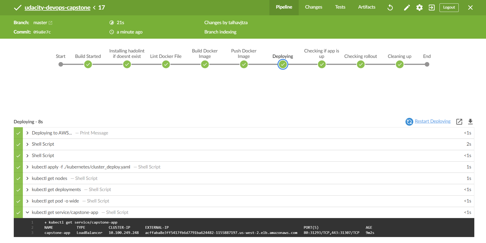
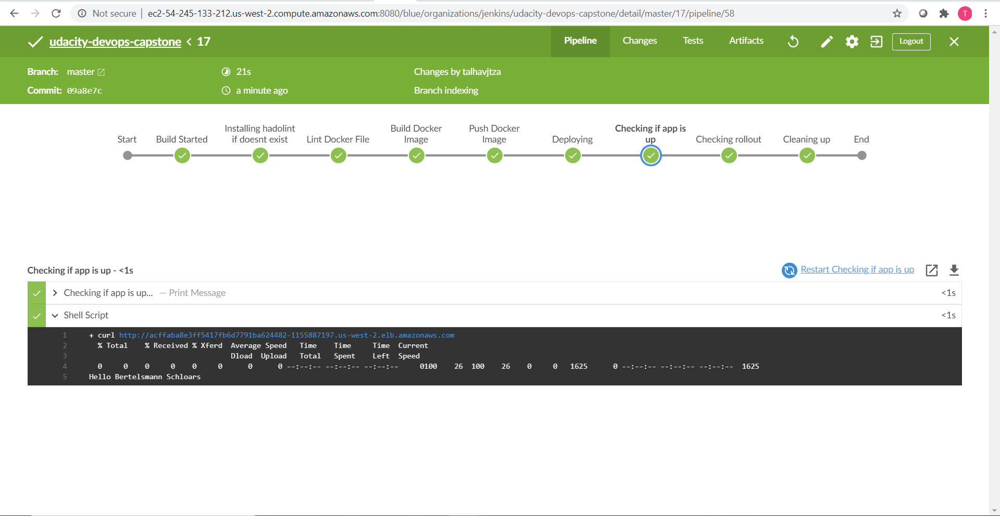

# Project: Capstone (Udacity Cloud DevOps Nanodegree)

In this project we will apply the skills and knowledge which were developed throughout the Cloud DevOps Nanodegree program. These include:

- Working in AWS
- Using Jenkins to implement Continuous Integration and Continuous Deployment
- Building pipelines
- Working with Ansible and CloudFormation to deploy clusters
- Building Kubernetes clusters
- Building Docker containers in pipelines

We will develop a CI/CD pipeline for micro services applications with rolling deployment. We will take a nodeJS app and dockerize it. Finally we will deploy this in a kubernetes cluster with 3 worker nodes and 1 node balancing instance in AWS. We will use jenkins for the CI/CD. We will also develop your Continuous Integration steps like linting and errors in containers. Finally as post deployment steps, we will perform additional testing by Jenkins whether the app is up and running, check whether it got successfully rolled out and also clean up the docker environment.  

# Project Overview:

The link of the final application on aws [link](http://acffaba8e3ff5417fb6d7791ba624482-1155887197.us-west-2.elb.amazonaws.com/)

The application we have used here was developed in the first phase of scholarship, link can be found [here](https://github.com/TalhaTZA/Bertelsmann_Blog_Challenge_Rest_Api) .The application is a simple node JS express api which sends response as strings.  
An article was also written on medium on how to host express api on heroku with [link](https://medium.com/@talhavjtza/hosting-express-api-on-heroku-cloud-service-eeba46514f5)  

Also added circle ci for linting docker files and circle ci build passing badge at the top.

# Complete Steps to be followed

1. Setting up the Jenkins instance - I have used aws ec2 ubuntu machine as the Jenkins instance. I also have added additional plugins in it like blue ocean, aws pipeline etc.

2. Set up the EKS cluster - The command can be found in the kubernetes folder with cluster_config.yaml

3. Now in order to deploy our app in this cluster, we created a Jenkinsfile which installs hadolint if unavailable, lints the dockerFile , builds and pushes the image on docker hub and executes command for kubernetes using kubectl

4. After Successful deployment our app is up and running at the DNS of the load balancer at port 80.

# Helps And References:

- https://www.digitalocean.com/community/tutorials/how-to-install-jenkins-on-ubuntu-18-04
- https://docs.aws.amazon.com/eks/latest/userguide/getting-started-eksctl.html
- https://www.eksworkshop.com/
- https://github.com/sagarnildass/Udacity-Cloud-Devops-Engineer-Nanodegree/blob/master/Course_5_Capstone_Project
- https://github.com/cncfkol/mean_eks_demo
- https://medium.com/@sagarnildass/how-i-completed-udacitys-cloud-devops-capstone-project-and-got-nominated-for-excellence-4bfb0ff09595